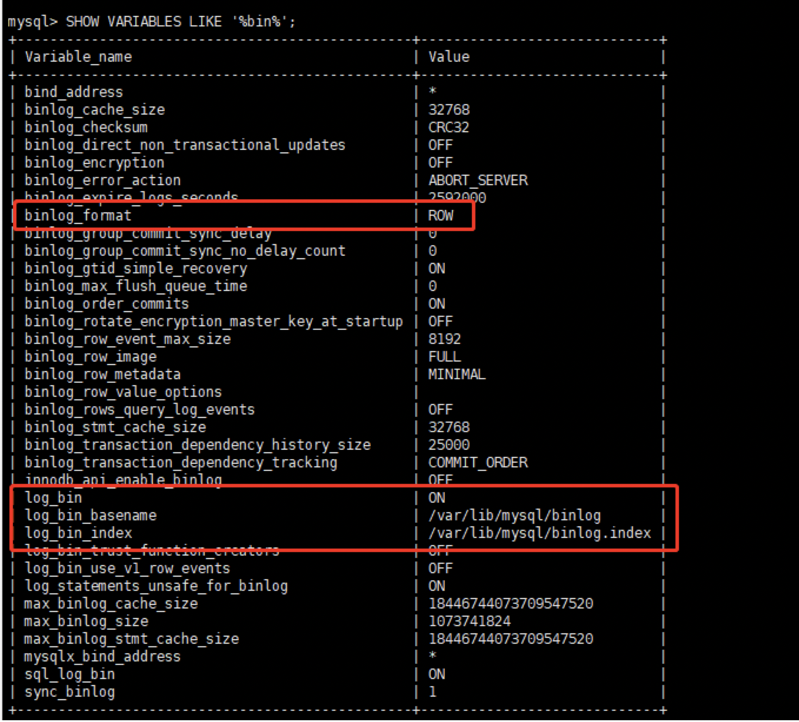

## 介绍
使用oracle提供的bundle安装包进行安装


## 前置准备

- CentOS 7系统
- [安装包下载: 阿里云镜像站](https://mirrors.aliyun.com/mysql/)
- [安装包下载: 清华镜像站](https://mirrors.tuna.tsinghua.edu.cn/mysql/downloads/MySQL-8.0/)
- 关键字查找 mysql-8.0.23-1.el7.x86_64.rpm-bundle.tar
> el7代表centos7、el6代表centos6


## 安装

```bash
# 依次安装下面6个rpm包 client-plugins -> common -> libs -> libs-compat -> client -> server
mysql-community-client-plugins
mysql-community-common
mysql-community-libs
mysql-community-libs-compat
mysql-community-client
mysql-community-server

# 强制安装
rpm -ivh mysql-community-client-plugins-8.0.27-1.el7.x86_64.rpm --force --nodeps
rpm -ivh mysql-community-common-8.0.27-1.el7.x86_64.rpm --force --nodeps
rpm -ivh mysql-community-libs-8.0.27-1.el7.x86_64.rpm --force --nodeps
rpm -ivh mysql-community-libs-compat-8.0.27-1.el7.x86_64.rpm --force --nodeps
rpm -ivh mysql-community-client-8.0.27-1.el7.x86_64.rpm --force --nodeps
rpm -ivh mysql-community-server-8.0.27-1.el7.x86_64.rpm --force --nodeps
```


## 安装包介绍

- common
- libs
- libs-compat
- client
- client-plugins
- server
- devel
- embedded-compat
- test


## 服务启停

```bash
# 启动服务, 关闭服务就是`service mysqld stop`
service mysqld start
```


## 账号修改

```bash
# 查看临时密码
[root@localhost log]# cat /var/log/mysqld.log 

# 登录临时root用户, 使用上面临时密码
[root@localhost log]# mysql -u root -p

#修改root账号密码
ALTER USER 'root'@'localhost' IDENTIFIED BY 'QWqw12!@';

# 切换数据库
use mysql;

# 修改root账号方便其他Host访问
UPDATE mysql.user SET host = '%' WHERE user = 'root';

# 赋予权限
GRANT ALL PRIVILEGES ON *.* TO 'root'@'%';

# 刷新权限
FLUSH PRIVILEGES;

# 退出
quit;
```

> 远程访问需要防火墙开放3306端口


## binlog开启

注意一点是MySQL8.x默认开启binlog

```sql
SHOW VARIABLES LIKE '%bin%';
```


## 配置文件地址
- /etc/my.cnf
- datadir=/var/lib/mysql
- log-error=/var/log/mysqld.log
- pid-file=/var/run/mysqld/mysqld.pid


## 卸载mysql

```shell
# 卸载软件包
rpm -e mysql-community-server-5.7.31-1.el6.x86_64.rpm
rpm -e mysql-community-client-5.7.31-1.el6.x86_64.rpm
rpm -e mysql-community-libs-compat-5.7.31-1.el6.x86_64.rpm
rpm -e mysql-community-libs-5.7.31-1.el6.x86_64.rpm
rpm -e mysql-community-common-5.7.31-1.el6.x86_64.rpm


 
# 删除文件
rm -rf /etc/my.cnf
rm -rf /etc/my.cnf.d
rm -rf  /var/lib/mysql
rm -rf  /var/log/mysqld.log
rm -rf  /var/run/mysqld/mysqld.pid
```