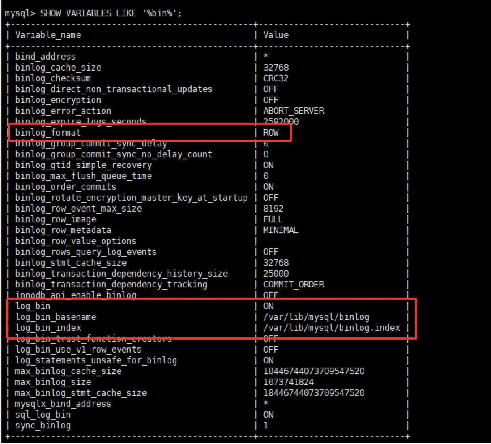

## 前置条件
- 两台mysql(参考hello-spring-boot/spring-boot-with-sharding-jdbc/demo)


## master配置

```sql
show master status;
show variables like '%server_id%';
show variables like '%log_bin%';

# 创建仅用于同步的账号(账号: backup, 密码:123456)
grant replication slave on *.* to 'backup'@'%' identified by '123456';
```


## slave节点配置

```
change master to master_host='db-master',master_user='backup',master_password='123456',master_log_file='mysql-bin.000003',master_log_pos=0,master_port=3306;
```

含义:
- `master_host`:     主节点的host
- `master_port`:     主节点的端口号
- `master_user`:     主节点用于同步的账号名
- `master_password`: 主节点用于同步的密码
- `master_log_file`: 需要补充
- `master_log_pos`:  需要补充


## slave配置

```
show slave status;

# 启动从库同步
start slave;

# 关闭从库同步
stop slave;
```


## binlog开启

注意一点是MySQL8.x默认开启binlog

```sql
SHOW VARIABLES LIKE '%bin%';
```



