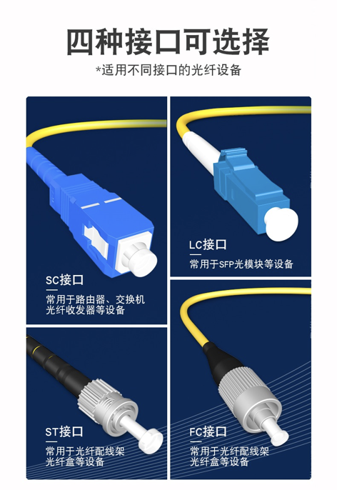

## 单模和双模

|          | 单模               | 双模   |
| -------- | ------------------ | ------ |
| 波长     | 发1310nm、收1550nm | 850nm  |
| 传输距离 | 传输距离           | 短距离 |
| 纤芯直径 |                    |        |
| 光源     |                    |        |

## 光纤接口

## 光模块

## 光交换机

## 光Mesh路由器

## 采购清单

| 品类               | 品牌    | 数量 | 备注 |
| ------------------ | ------- | ---- | ---- |
| 隐形光纤           |         |      |      |
| 转角保护器         |         |      |      |
| 红光笔             |         |      |      |
| 分光器             |         |      |      |
| 热熔枪及胶棒       |         |      |      |
| LC-LC单工耦合器    |         | 1    |      |
| PCI-E万兆光网卡    |         |      |      |
| 8口万兆交换机      | TP-LINK | 1    |      |
| 万兆单模单纤光模块 |         |      |      |
| 光口Mesh路由器     | TP-LINK |      |      |

光功率计

光纤盒

## 光纤布线

1. 弱电箱 到书房
2. 书房到客厅
3. 书房到主卧
4. 书房到南次卧
5. 书房到西次卧
6. 书房到卫生间
7. 书房到厨房

