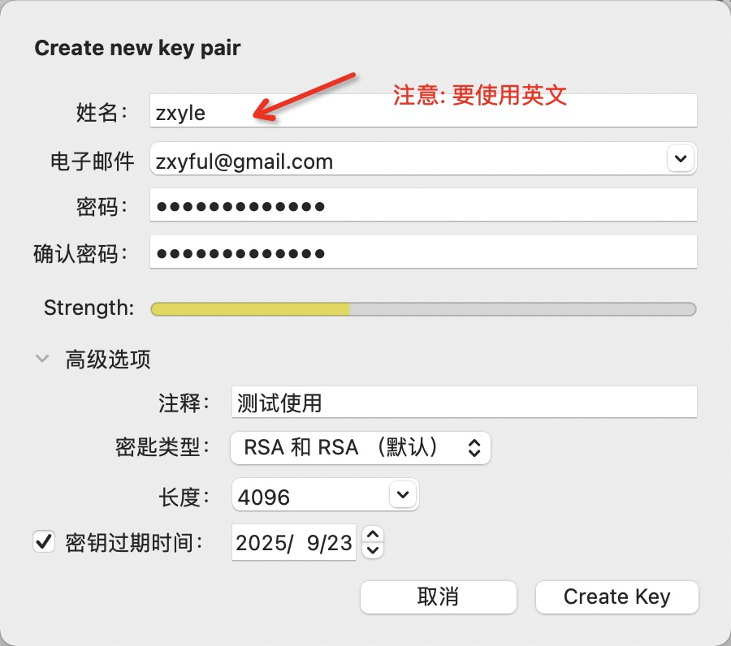
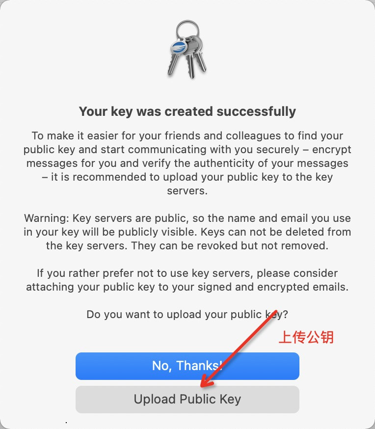

**配置GPG**
- macos gpg 下载 https://gpgtools.org/
- Windows 下载 https://www.gpg4win.org/

以MacOS为例:

打开 GPG keychain -> 点击新建







## 进入邮箱， 点击验证链接

## git提交配置

```
gpg --list-secret-keys --keyid-format LONG

git config --global user.signingkey [sec rsa4096/后面复制]

// 所有项目都启用签名验证
git config --global commit.gpgsign true
```
