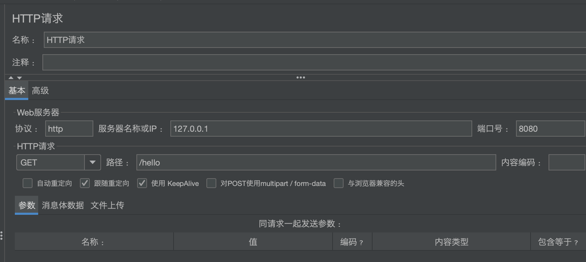
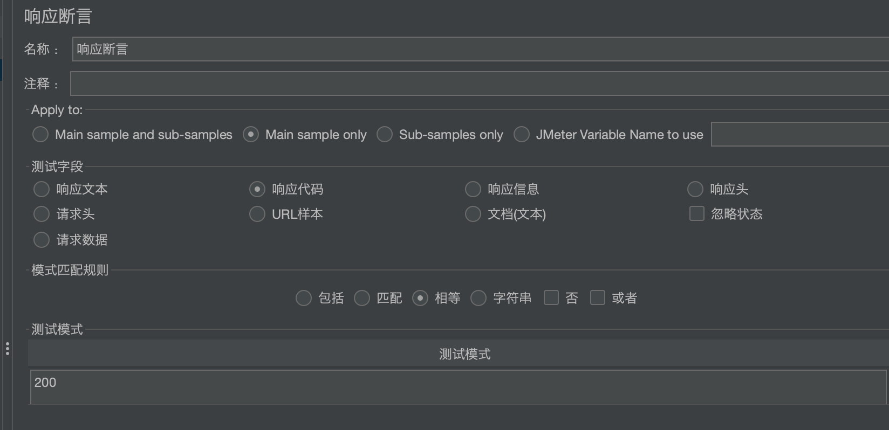
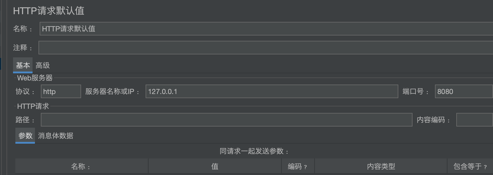

## 介绍
apache开源的压力测试工具


## 下载 & 安装

- [官网下载](https://jmeter.apache.org/download_jmeter.cgi)
- [阿里云镜像下载](https://mirrors.aliyun.com/apache/jmeter/binaries/)


## 使用

### 启动

```shell
cd apache-jmeter-5.4.1/
./bin/jmeter
```


### 设置中文
Options -> Choose Language -> Chinese


### 设置线程组

右键TestPlan -> 添加 -> 线程（用户）-> 线程组

- 线程数
- Ramp-Up时间， 多长时间达到线程数 


### 设置请求

右键线程组 -> 添加 -> 取样器 -> HTTP请求




### 设置断言

右键HTTP请求 -> 断言 -> 响应断言




### 设置监听器

右键HTTP请求 -> 添加 -> 监听器 -> 察看结果树、汇总报告、聚合报告、汇总图


### 设置默认值

右键TestPlan -> 配置元件 -> HTTP请求默认值




## Linux下使用

- 导出jmx脚本文件
- 运行jmeter `./jmeter -n -t 脚本.jmx -l XX.jtl`
- 生成报告 `./jmeter -g XX.jtl -e -o /root/resultReport`