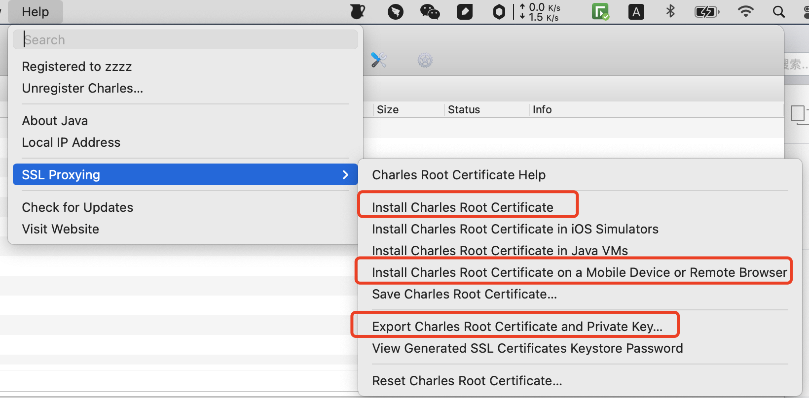

## 介绍

https://www.charlesproxy.com/

## 安装

- [官网下载](https://www.charlesproxy.com/download)
- [破解工具](https://www.zzzmode.com/mytools/charles/)

## 使用说明
- Proxy -> Proxy Settings -> 勾选 Enable transparent HTTP proxying
- Proxy -> Proxy Settings -> macOS -> Enable macOS proxy 和Enable macOS proxy on launch
- Proxy -> SSL Proxying Settings -> 输入类似www.baidu.com:443

## 安装证书

端口8888
